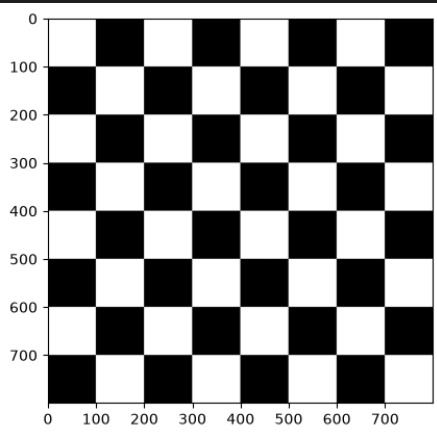
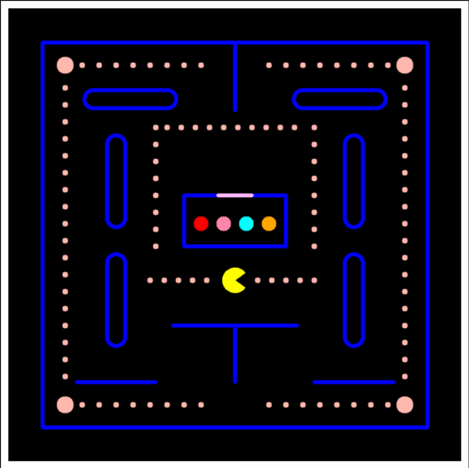
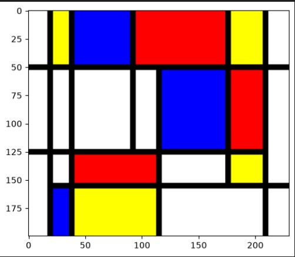
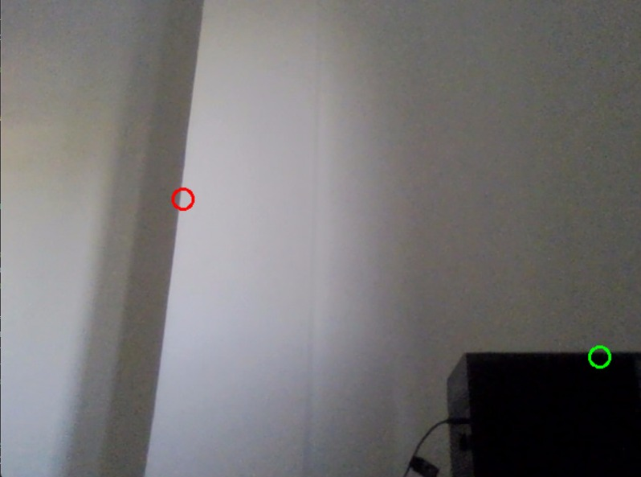
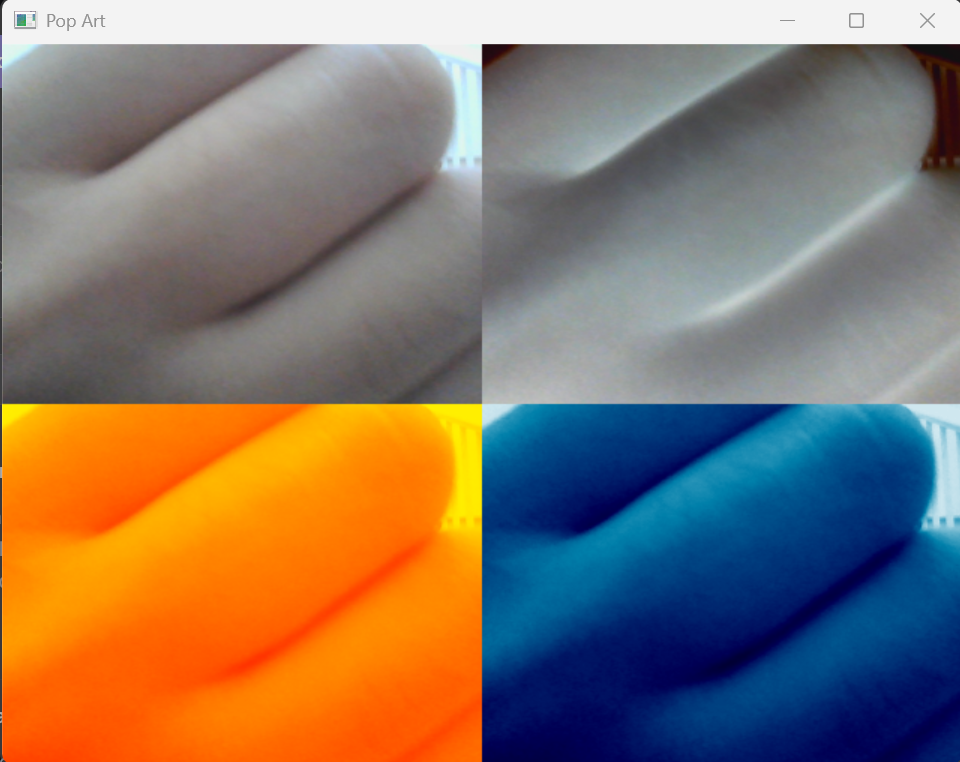

# Práctica 1: Introducción a OpenCV - Visión por Computador

Repositorio de la Práctica 1 de la asignatura Visión por Computador (ULPGC). El proyecto, desarrollado mediante el cuaderno interactivo `VC_P1.ipynb`, aplica transformaciones matriciales, primitivas de dibujo y filtros de vídeo en tiempo real.

## Estructura y Requisitos

El entorno de desarrollo requiere Python y las siguientes dependencias estándar: `opencv-python`, `numpy` y `matplotlib`. El proyecto se organiza de la siguiente manera:

* **`VC_P1.ipynb`**: Cuaderno principal que contiene el código fuente, la ejecución por bloques y la justificación de las decisiones técnicas.
* **`assets/`**: Directorio destinado a almacenar las capturas de pantalla y demostraciones visuales de los resultados generados.

## Desarrollo de las Tareas y Ampliación

El cuaderno respeta la progresión del guion oficial para dar cumplimiento a las tareas exigidas, incorporando una ampliación voluntaria en el bloque de dibujo:

* **Tarea - Creación de un tablero de ajedrez:** Generación de un tablero de juego mediante una cuadrícula de rectángulos alternos
  > 

* **Ampliación - Primitivas de dibujo (Tablero Pac-Man):** Recreación vectorial del laberinto arcade clásico. Se ha parametrizado la simetría del tablero matemáticamente y se han utilizado funciones como `cv2.ellipse`, `cv2.circle`, entre otras.
  > 

* **Tarea - Creación de una imagen estilo Mondrian:** Recreación de una obra del pintor Piet Mondrian mediante el uso de líneas y rectángulos
  > 

* **Tarea - Detección del pixel más oscuro y claro:** Identificación de los puntos de máxima y mínima luminosidad en una imagen digital.
  > 

* **Tarea - Falso color (Composición Pop Art):** Procesamiento del canal de luminancia mediante `cv2.applyColorMap` para aplicar paletas predefinidas. El ensamblado del mosaico 2x2 se realiza de forma vectorial y eficiente con `np.hstack` y `np.vstack`.
  > 

## Instrucciones de Uso

Para evaluar el proyecto correctamente y asegurar la estabilidad del entorno:

* Iniciar la sesión en Jupyter Notebook o entorno compatible y abrir el archivo `VC_P1.ipynb`.
* Ejecutar las celdas de forma secuencial para compilar las funciones en el orden establecido.
* En las celdas que invocan la captura de vídeo, es indispensable mantener el foco en la ventana emergente de OpenCV y presionar la tecla `ESC` para liberar el dispositivo de hardware y finalizar el proceso.

## Declaración de Uso de IA

Conforme a las directrices de la asignatura, se declara el uso de herramientas de Inteligencia Artificial bajo un rol estricto de consultoría técnica. Su aplicación se ha limitado a:

* La optimización del ensamblado matricial con NumPy para evitar el uso de bucles e índices manuales.
* La comprensión de los mapas de colores para la correcta aplicación de falso color en OpenCV.
* El diseño de funciones espaciales para automatizar la simetría geométrica en la generación del tablero.
